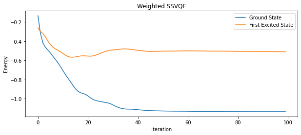
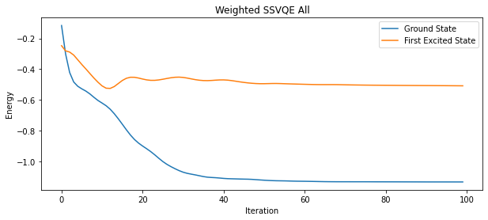
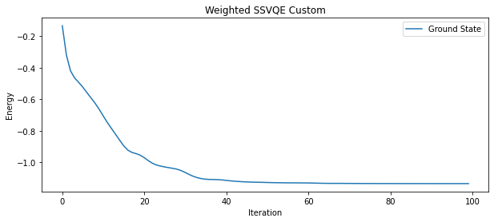
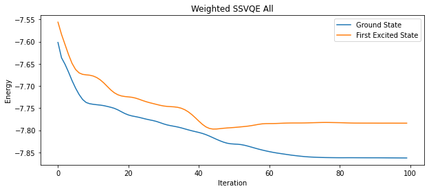
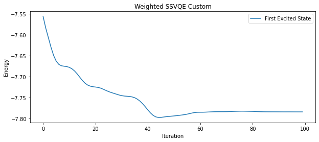
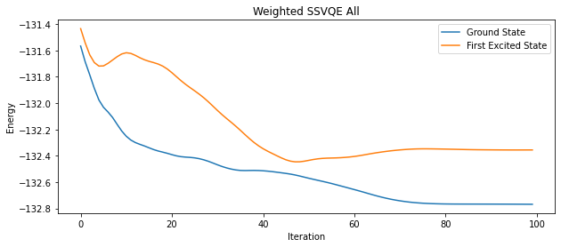
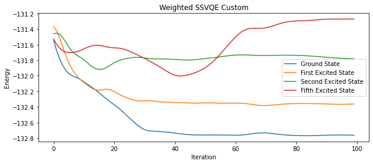

# Weighted Subspace Search VQE to find Kth Excited state energies

Generally, The variational quantum eigensolver (VQE) is used for finding the ground state energy for a given hamiltonian. To find the kth excited state energy of for the hamiltonian we would need to run the VQE optimization process for atleast k+1 time. Not to mention each time we need to calculate the hamiltonian again taking into account the state of the previous iteration. Even after that the accuracy decreases as value of k increases.

This is where the idea of ***Subspace Search VQE (SSVQE)*** comes in. The algorithm is used to find kth excited state energy of a hamiltonian in just two subsequent optimization processes. The original research about the development of SSVQE is given in this [paper](https://arxiv.org/pdf/1810.09434.pdf). But, can we do better? Yes, the research shows that using the weights as hyperparameters we can find the kth excited state energy in just single optimization process. This is a more generalised version of SSVQE namely, Weighted SSVQE and it will be the center of our focus in this project. There are two variants of this algorithm:

1) Weighted SSVQE to find kth excited state energy.

2) Weighted SSVQE to find all energies upto kth excited state.

We simulated three different Hamiltonians of molecules like H2, LiH and CH3F using three algorithms that we implemented in this project. Yes, the third one is surprise for you so for more detalied info go check out [SSVQE.ipynb](./SSVQE.ipynb)

## Results of Simulation:
### H2:

### LiH:

### CH3F

## Requirements
Before you start with [SSVQE.ipynb](https://github.com/Jay-Patel-257/Qhack-2022/blob/main/SSVQE.ipynb) make sure to install the below requirements. 
`!pip install pennylane` 
`!pip install pennylane-qchem`

## Prepared by:
**Jay Patel** 
**Siddharth Patel** 
**Amit Hirpara**

## References
* https://arxiv.org/pdf/1810.09434.pdf
* https://pubchem.ncbi.nlm.nih.gov/1[
